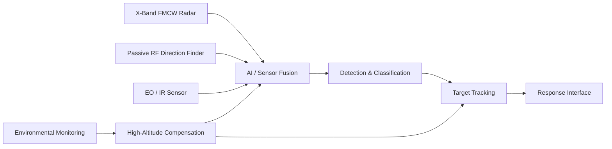
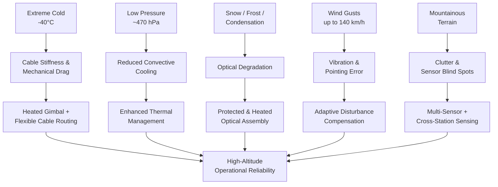

# 🛡️ VAYU ASTRA

### High-Altitude Performance Optimization and Robust Design of Anti-Drone System

**Smart India Hackathon 2026**  
**Problem Statement ID:** SIH26050  
**Theme:** Defence & Strategic Technologies  
**Category:** Hardware  
**Team:** Vayu Astra  

---

## 📑 Table of Contents

- [Project Overview](#project-overview)
- [Problem Statement](#problem-statement)
- [Proposed Solution](#proposed-solution)
- [System Architecture](#system-architecture)
- [High-Altitude Design Envelope](#design-envelope)
- [Key Engineering Innovations](#engineering-innovations)
- [Operational Workflow](#operational-workflow)
- [Development Status](#development-status)
- [Potential Applications](#applications)
- [Indigenous Development](#indigenous-development)
- [Future Development](#future-development)
- [Research Areas](#research)
- [Team](#team)
- [Project Status](#project-status)

---


<a id="project-overview"></a>

## 📌 Project Overview

Vayu Astra is a high-altitude anti-drone system concept developed for Smart India Hackathon 2026. The project focuses on maintaining reliable drone detection, tracking and identification under extreme high-altitude environmental conditions.

Conventional anti-drone systems can experience performance degradation in mountainous regions due to sub-zero temperatures, reduced atmospheric pressure, strong winds, frost and condensation, cable stiffening, reduced cooling efficiency and terrain-induced sensing blind spots.

Vayu Astra addresses these challenges through a rugged multi-sensor architecture combining radar, passive RF sensing, EO/IR tracking, sensor fusion and environmental compensation.

---

<a id="problem-statement"></a>

## 🎯 Problem Statement

Anti-drone systems deployed in high-altitude regions operate under significantly different environmental conditions compared with systems deployed at normal altitude.

Major challenges include:

- Sub-zero cable stiffening
- Bearing and lubricant performance degradation
- Reduced convective cooling at low atmospheric pressure
- Frost and condensation on optical systems
- High wind loads and mechanical vibration
- Mountain-induced radar clutter and multipath
- Sensor blind spots caused by terrain
- Temperature-dependent pointing and tracking errors

For precision surveillance systems, even small mechanical or thermal disturbances can reduce line-of-sight stability and tracking accuracy.

The objective of Vayu Astra is therefore to develop a **rugged and adaptive high-altitude anti-drone architecture** capable of maintaining sensing and tracking performance under extreme Himalayan environmental conditions.

---

<a id="proposed-solution"></a>

## 💡 Proposed Solution

Vayu Astra uses a multi-layer sensing and processing architecture consisting of:

- **X-Band GaN FMCW 3D Radar** for long-range detection and tracking
- **Passive RF Direction Finder** for detection and direction estimation of RF-emitting drones
- **EO/IR Gimbal** for visual and thermal target confirmation
- **AI-Based Sensor Fusion** for combining radar, RF and optical observations
- **Environmental Compensation System** for maintaining performance under extreme temperature and pressure conditions
- **Cross-Station Sensing** to improve coverage in mountainous terrain

The complete system follows a simple operational architecture:

### SENSE → THINK → RESPOND

**SENSE**  
Radar, RF and EO/IR sensors acquire information from the surrounding airspace.

**THINK**  
Sensor data is filtered, correlated and processed to support target identification, tracking and environmental compensation.

**RESPOND**  
The system maintains continuous tracking and provides a response interface for authorized counter-UAS actions.

---

<a id="system-architecture"></a>

## ⚙️ System Architecture

The proposed architecture consists of four major functional layers:

### 1. Detection Layer
Collects information using radar, RF and electro-optical/infrared sensors.

### 2. Processing Layer
Performs noise filtering, sensor fusion, target correlation and classification.

### 3. Tracking Layer
Maintains continuous target tracks using fused observations from multiple sensors.

### 4. Environmental Compensation Layer
Compensates for high-altitude effects including temperature variation, mechanical drag, reduced cooling and optical degradation.


### System-Level Architecture



---

<a id="design-envelope"></a>

## 🏔️ High-Altitude Design Envelope

The proposed system is designed around the following environmental targets:

| Parameter | Design Target |
|---|---|
| Temperature | -40°C to +50°C |
| Atmospheric Pressure | ~470 hPa |
| Operating Altitude | Up to 14,000 ft |
| Wind Gusts | Up to 140 km/h |
| Environment | Snow, frost, high UV and abrasive conditions |
| Electronics | EMI/EMC protected |


### Environmental Challenge & Compensation Architecture



---

<a id="engineering-innovations"></a>

## 🔬 Key Engineering Innovations

### Adaptive Disturbance Compensation

Temperature-dependent cable stiffness, friction and mechanical disturbances can introduce pointing errors in precision EO/IR systems. The proposed control architecture uses adaptive disturbance compensation to reduce these effects during tracking.

### Sub-Zero Gimbal Design

The EO/IR gimbal concept incorporates:

- Flexible silicone-TPE cable routing
- Heated mechanical sections
- Direct-drive BLDC actuation
- Low-temperature-compatible lubrication

These measures are intended to maintain smooth movement under sub-zero conditions.

### Protected Optical System

A sealed and environmentally controlled optical enclosure is proposed to reduce internal condensation and optical degradation caused by rapid temperature and pressure changes.

### Cross-Station Sensing

Multiple sensing stations can exchange tracking information to reduce terrain-induced blind spots. Overlapping coverage allows one station to support another when mountain geometry limits direct sensor visibility.

---

<a id="operational-workflow"></a>

## 🔄 Operational Workflow

```text
RADAR ──────┐
            │
RF SENSOR ──┼──► SENSOR FUSION ──► TARGET DETECTION
            │                           │
EO / IR ────┘                           ▼
                                  CLASSIFICATION
                                        │
                                        ▼
                                     TRACKING
                                        │
                                        ▼
                                                                                             RESPONSE INTERFACE
```

---

<a id="development-status"></a>

## 🧩 Development Status

Vayu Astra is currently being developed as an engineering concept and prototype architecture for Smart India Hackathon 2026.
Current work focuses on:
- System architecture design
- High-altitude environmental analysis
- Sensor selection
- Sensor-fusion architecture
- Mechanical ruggedization
- Thermal-management strategy
- EO/IR stabilization
- Multi-station coverage modelling
- Prototype planning

---

<a id="applications"></a>

## 🚀 Potential Applications

The underlying sensing and high-altitude engineering architecture may support applications such as:
- High-altitude airspace monitoring
- Critical infrastructure surveillance
- Border-area situational awareness
- Remote environmental monitoring
- Avalanche search support
- Thermal observation
- Mountain surveillance systems

---

<a id="indigenous-development"></a>

## 🇮🇳 Indigenous Development

Vayu Astra emphasizes a modular architecture that can progressively incorporate domestically developed electronics, mechanical components, signal-processing software and sensor-fusion algorithms.
The modular approach also allows individual subsystems to be upgraded without redesigning the complete platform.

---

<a id="future-development"></a>

## 🔮 Future Development

Future development of the project can include:
- Physical prototype development
- Environmental chamber testing
- Radar and EO/IR sensor integration
- Real-time multi-sensor fusion
- Improved drone classification models
- Gimbal stabilization testing
- Thermal-management validation
- High-altitude field testing
- Multi-station communication
- Performance benchmarking

---

## 📖 Technical Documentation

Detailed engineering documentation is maintained separately from this project overview.

### Available Documents

- [⚙️ Technical Design Document](docs/TECHNICAL_DESIGN.md) — Detailed system architecture, sensor stack, sensor-fusion pipeline, high-altitude environmental design, mechanical and thermal considerations, prototype development plan, validation metrics, and engineering limitations.

- [📚 Research & Technical References](docs/REFERENCES.md) — Verified engineering standards and reference sources used to guide environmental, EMI/EMC, and aerospace wiring considerations.


---

<a id="research"></a>

## 📚 Research Areas

The project draws on engineering research and standards covering:
- Environmental qualification
- EMI/EMC testing
- Precision gimbal stabilization
- Low-temperature materials
- FMCW radar
- EO/IR sensing
- Multi-sensor fusion
- High-altitude thermal management
Detailed references will be maintained separately in the project documentation.

---

<a id="team"></a>

## 👥 Team

Team Name: Vayu Astra
Competition: Smart India Hackathon 2026
Problem Statement: SIH26050
Category: Hardware
Theme: Defence & Strategic Technologies

---

 <a id="project-status"></a>
 
## 📄 Project Status

🚧 Research & Prototype Development

This repository documents the ongoing engineering design, research and prototype development of Vayu Astra for Smart India Hackathon 2026.
