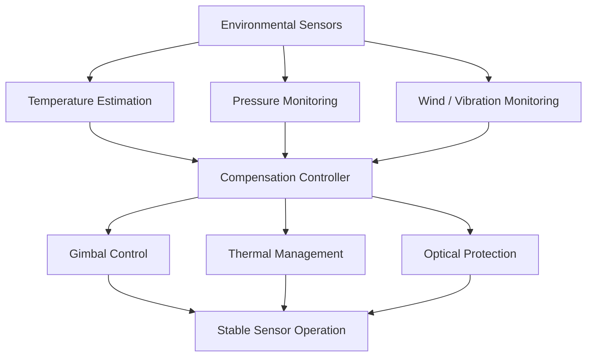

# Vayu Astra — Technical Design Document

**Project:** High-Altitude Performance Optimization and Robust Design of Anti-Drone System  
**Smart India Hackathon 2026**  
**Problem Statement ID:** SIH26050  
**Team:** Vayu Astra  
**Document Type:** Technical Design & Engineering Report  

---

## 1. Purpose

Vayu Astra is a high-altitude anti-drone engineering concept focused on maintaining reliable sensing, identification, and tracking performance in extreme mountainous environments.

The project addresses environmental effects that can degrade conventional surveillance and tracking systems, including extreme cold, low atmospheric pressure, strong winds, frost and condensation, reduced convective cooling, mechanical stiffening, and terrain-induced sensor blind spots.

The proposed design combines multi-modal sensing, sensor fusion, environmental compensation, and ruggedized mechanical and thermal subsystems.

---

## 2. Design Objectives

The primary engineering objectives are:

- Maintain reliable drone detection and tracking in high-altitude terrain.
- Reduce dependence on a single sensing modality.
- Compensate for temperature-dependent mechanical disturbances.
- Protect optical components from frost and condensation.
- Maintain electronics within safe thermal operating limits at reduced atmospheric pressure.
- Improve coverage in terrain containing valleys, ridges, and radar-shadow regions.
- Use a modular architecture that allows individual sensing and processing subsystems to be upgraded independently.

---

## 3. System-Level Architecture

Vayu Astra is divided into four major functional areas.

### 3.1 Sensing

The sensing layer provides complementary observations of the monitored airspace.

Proposed sensing modalities include:

- X-Band FMCW radar
- Passive RF direction finding
- EO/IR imaging
- Environmental sensing

Using multiple sensor types improves resilience because the system does not depend entirely on a single detection mechanism.

### 3.2 Processing

Sensor observations are passed to a central processing layer responsible for:

- Noise filtering
- Time synchronization
- Observation correlation
- Sensor fusion
- Target classification support
- Track generation
- Environmental compensation

### 3.3 Tracking

After detection and classification, the system maintains a continuous target track.

The tracking layer receives fused observations rather than depending on only one sensor, allowing radar, RF, and optical information to complement each other.

### 3.4 Response Interface

Validated tracking information is forwarded to a controlled response interface.

The repository focuses primarily on sensing, tracking, high-altitude optimization, and system engineering rather than operational deployment of countermeasure mechanisms.

---

## 4. Proposed Sensor Stack

### 4.1 X-Band FMCW Radar

The proposed radar subsystem provides primary three-dimensional detection and tracking.

**Design role:**

- Range estimation
- Relative velocity estimation
- Angular tracking
- Continuous airspace surveillance
- Track generation

The SIH concept considers a **20 km-class radar design target**, subject to final hardware selection, antenna configuration, target characteristics, terrain, and environmental validation.

### 4.2 Passive RF Direction Finder

The RF sensing subsystem passively observes radio-frequency activity associated with airborne platforms.

The proposed observation range covers approximately:

**0.4 GHz – 6.0 GHz**

Its role within the architecture is to provide an additional directional observation that can be correlated with radar and optical tracks.

Passive sensing is particularly useful as a complementary channel because it does not require the RF subsystem itself to transmit during observation.

### 4.3 EO/IR Tracking

The electro-optical/infrared subsystem provides visual and thermal observations.

Its primary roles include:

- Target confirmation
- Fine angular tracking
- Thermal observation
- Visual classification support
- Cross-verification of radar/RF observations

A stabilized gimbal is proposed to maintain the optical line of sight while the platform is exposed to wind, vibration, and temperature-dependent mechanical disturbances.

---

## 5. Sensor Fusion Pipeline

The proposed information-processing sequence is:

```text
SENSOR ACQUISITION
        |
        v
PRE-PROCESSING
        |
        v
NOISE FILTERING
        |
        v
OBSERVATION CORRELATION
        |
        v
MULTI-SENSOR FUSION
        |
        v
TARGET DETECTION
        |
        v
CLASSIFICATION
        |
        v
TRACK GENERATION
        |
        v
CONTINUOUS TRACKING
```

Radar provides range and motion information, RF sensing contributes directional information when relevant emissions are present, and EO/IR provides optical or thermal confirmation.

The fusion layer combines these observations into a common track representation.

---

## 6. High-Altitude Environmental Design

The proposed engineering design envelope is:

| Parameter | Design Target |
| --- | --- |
| Temperature | -40°C to +50°C |
| Atmospheric Pressure | Approximately 470 hPa |
| Operating Altitude | Up to 14,000 ft |
| Wind Gusts | Up to 140 km/h |
| Exposure | Snow, frost, high UV, and abrasive conditions |
| Electronics | EMI/EMC protection required |

These values represent engineering design targets and require validation through environmental and field testing.

---

## 7. Mechanical Challenges

### 7.1 Cable Stiffening

At very low temperatures, cable jackets and internal materials can become less flexible.

In a precision gimbal, increased cable stiffness may generate additional torque and interfere with smooth rotational motion.

### 7.2 Proposed Mitigation

The design considers:

- Flexible silicone-TPE cable routing
- Controlled cable bend radius
- Low-temperature-compatible wiring
- Heated gimbal regions
- Direct-drive BLDC actuation
- Disturbance compensation in the control loop

---

## 8. Gimbal Stabilization

Precision EO/IR tracking requires stable line-of-sight control.

Potential disturbances include:

- Wind loading
- Mechanical vibration
- Cable torque
- Bearing friction
- Temperature-dependent material properties

Vayu Astra proposes an adaptive disturbance compensation approach in which disturbances affecting the gimbal are estimated and compensated within the control architecture.

The SIH concept targets line-of-sight tracking performance below approximately **25 µrad**, subject to prototype validation.

---

## 9. Thermal Management

Low atmospheric pressure reduces convective heat transfer.

This can increase thermal stress on:

- RF power electronics
- Processing hardware
- Power-conversion electronics
- Motor drivers
- Enclosed electronic modules

The proposed thermal-management strategy considers:

- Conductive heat spreading
- Controlled heating for cold-sensitive components
- Insulated electronics compartments
- Temperature monitoring
- Appropriate thermal interfaces
- Heat-transfer solutions suited to reduced-pressure operation

The final thermal architecture will depend on measured subsystem power dissipation and prototype testing.

---

## 10. Optical Protection

High-altitude optical systems may encounter:

- Frost
- Condensation
- Snow deposition
- Rapid temperature changes
- Reduced visibility

The proposed design uses an environmentally protected optical enclosure.

Engineering concepts considered include:

- Sealed optical housing
- Dry-gas environment
- Controlled internal pressure
- Heated optical surfaces
- Moisture management
- Environmental monitoring

The objective is to maintain usable optical and thermal imagery during changing environmental conditions.

---

## 11. Terrain-Induced Sensing Challenges

Mountainous terrain introduces additional sensing problems, including:

- Radar shadow regions
- Multipath propagation
- Terrain clutter
- Line-of-sight obstruction
- Valley-induced blind zones

A single sensing station cannot guarantee identical coverage across complex terrain.

For this reason, Vayu Astra proposes a multi-station architecture.

---

## 12. Cross-Station Sensing

Multiple stations can exchange track information and provide overlapping observations.

Conceptually:

```text
STATION A                         STATION B
---------                         ---------
Radar                             Radar
RF Sensor                         RF Sensor
EO/IR                             EO/IR
   |                                 |
   +---------- Shared Tracks --------+
                     |
                     v
             CORRELATED AIRSPACE
                  PICTURE
```

The SIH concept considers approximately **5 km of intended overlap** between neighboring sensing regions.

Actual station spacing would depend on terrain, sensor performance, line of sight, and field measurements.

---

## 13. Operational Architecture

Vayu Astra follows a three-stage operational model:

### 13.1 SENSE

Acquire observations through:

- Radar
- Passive RF
- EO/IR
- Environmental sensors

### 13.2 THINK

Process observations through:

- Filtering
- Sensor fusion
- Classification
- Tracking
- Environmental compensation

### 13.3 RESPOND

Provide validated tracking information to an authorized response interface while maintaining closed-loop observation.

---

## 14. Environmental Compensation Architecture



The environmental-compensation architecture allows measured environmental conditions to influence the subsystems most affected by high-altitude operation.

---

## 15. Modular Hardware Philosophy

The platform is designed as a modular system rather than a single tightly integrated unit.

Major functional modules include:

1. Radar subsystem
2. Passive RF subsystem
3. EO/IR subsystem
4. Processing subsystem
5. Environmental-control subsystem
6. Power subsystem
7. Communications subsystem
8. Mechanical support structure

This architecture allows individual components to be developed, tested, maintained, and upgraded independently.

---

## 16. Prototype Development Plan

### Phase 1 — Architecture

- Finalize system requirements.
- Define subsystem interfaces.
- Develop mechanical layout.
- Establish power and communication architecture.

### Phase 2 — Individual Subsystem Testing

- Environmental sensor testing.
- Processing-platform testing.
- EO/IR gimbal testing.
- RF sensing experiments.
- Radar-interface development.

### Phase 3 — Integration

- Integrate sensor interfaces.
- Implement time synchronization.
- Develop the sensor-fusion pipeline.
- Integrate environmental monitoring.

### Phase 4 — Controlled Testing

- Temperature testing.
- Vibration testing.
- Thermal testing.
- Tracking experiments.
- Sensor-fusion evaluation.

### Phase 5 — Environmental Validation

- Reduced-temperature testing.
- Reduced-pressure testing where suitable facilities are available.
- Wind and vibration testing.
- Outdoor terrain testing.
- Multi-station experiments.

---

## 17. Validation Metrics

Prototype performance can be evaluated using measurable engineering parameters.

| Subsystem | Example Metric |
| --- | --- |
| Radar | Detection consistency |
| EO/IR | Tracking stability |
| Gimbal | Pointing error |
| Sensor Fusion | Track consistency |
| Thermal System | Component temperature |
| Environmental Control | Internal temperature stability |
| Multi-Station System | Track continuity |
| Processing | End-to-end latency |

---

## 18. Engineering Limitations

The current Vayu Astra design is an engineering concept and prototype architecture.

Several specifications remain **design targets rather than experimentally verified performance figures**.

These include:

- Maximum detection range
- Line-of-sight accuracy
- Environmental operating limits
- Multi-station coverage
- Thermal performance
- Classification accuracy
- Long-duration reliability

These values must be validated using physical prototypes, calibrated instrumentation, and representative environmental testing.

---

## 19. Future Engineering Work

Future development should focus on:

- Prototype sensor integration
- Real-time sensor fusion
- Environmental chamber testing
- Gimbal-control implementation
- Low-temperature cable characterization
- Thermal modelling
- Multi-station synchronization
- Terrain-aware coverage modelling
- Data collection
- Drone-classification research
- Reliability testing
- Field validation

---

## 20. Conclusion

Vayu Astra approaches the high-altitude anti-drone problem primarily as an environmental and systems-engineering challenge.

Rather than relying on a single sensor, the proposed architecture combines radar, passive RF sensing, EO/IR observation, and multi-sensor processing.

The main engineering contribution is the integration of this sensing architecture with high-altitude mechanical, thermal, optical, and environmental compensation techniques.

The long-term objective is to progress from the current engineering concept to a measurable prototype whose performance can be validated under representative high-altitude conditions.

---

## Document Status

**Status:** Engineering Concept / Prototype Development  
**Competition:** Smart India Hackathon 2026  
**Problem Statement:** SIH26050  
**Team:** Vayu Astra  

---

[← Back to Main Project Page](../README.md)
